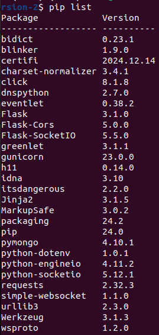

# Setup Env

1. Navigate to the app folder:

```bash
cd Turing-Test-website-version-2/
```

2. Create virtual env:

```bash 
rm -rf venv
python3.12 -m venv venv
source venv/bin/activate
```

3. Install requirements:

```bash
pip install -r requirements.txt
```

# Setup Frontend Project

1. Navigate to the frontend folder

```bash
cd frontend/
```

2. Install npm
```bash
npm install
```

3. Build the react project
```bash
npm run build
```

4. Copy the new build folder to the backend folder
```bash
cd ..
cp -r frontend/build backend/
```


# How to run

Run app on ec2 instance inside the venv
```bash
nohup gunicorn --worker-class eventlet -w 1 -b 0.0.0.0:5000 backend.app:app &
```

Check the running processes
```bash
ps aux | grep gunicorn
```

Kill all gunicorn processes
```bash
pkill gunicorn
```

Kill specific gunicorn process
```bash
pkill gunicorn
```

```bash
kill -9 <process number>
```

# My env pip list
